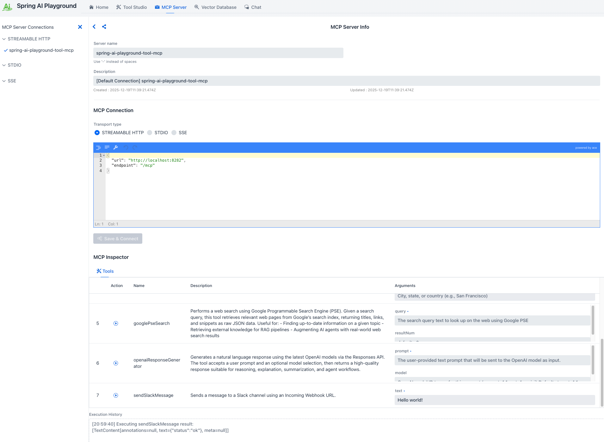
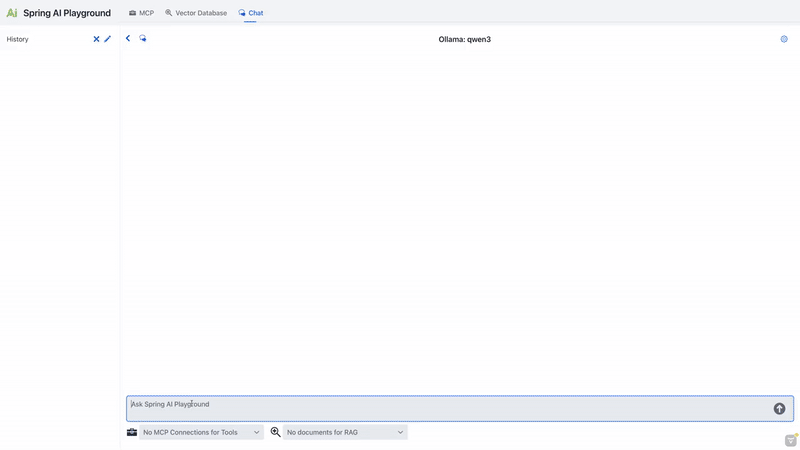
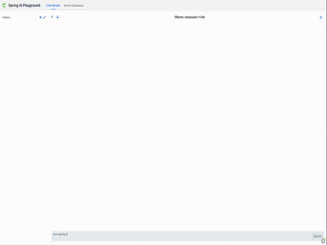

# Spring AI Playground

**Spring AI Playground** is a self-hosted web UI that simplifies AI experimentation and testing. It provides Java developers with an intuitive interface for working with **large language models (LLMs)**, **vector databases**, **prompt engineering**, and **Model Context Protocol (MCP)** integrations.

Built on **Spring AI**, it supports leading model providers and includes comprehensive tools for testing **retrieval-augmented generation (RAG)** workflows and MCP integrations. The goal is to make AI more accessible to developers, helping them quickly prototype **Spring AI-based applications** with enhanced contextual awareness and external tool capabilities.

## Quick Start

Build and run the app:
```
./mvnw clean install
./mvnw spring-boot:run
```
Open http://localhost:8080 in your browser.

## Auto-configurations

Spring AI Playground uses Ollama by default for local LLM and embedding models. No API keys are 
required, which makes it easy to get started.

## AI Models
To enable Ollama, ensure it is installed and running on your system. Refer to the [Spring AI Ollama Chat Prerequisites](https://docs.spring.io/spring-ai/reference/api/chat/ollama-chat.html#_prerequisites) for setup details.

### Support for All Major AI Model Providers
Spring AI Playground supports all major AI model providers, including Anthropic, OpenAI, Microsoft, Amazon, Google, and Ollama. For more details on the available implementations, visit the [Spring AI Chat Models Reference Documentation](https://docs.spring.io/spring-ai/reference/api/chatmodel.html#_available_implementations).

### Switching to OpenAI

Switching to **OpenAI** is a primary example of how you can use a different AI model with Spring AI Playground. To explore other models supported by Spring AI, learn more in the [Spring AI Documentation](https://spring.io/projects/spring-ai).

To switch to OpenAI, follow these steps:

- **Modify the [`pom.xml`](./pom.xml) file**:
   
   - Remove the Ollama dependency:
     ```xml
     <dependency>
        <groupId>org.springframework.ai</groupId>
        <artifactId>spring-ai-ollama-spring-boot-starter</artifactId>
     </dependency>
     ```

   - Add the OpenAI dependency:
     ```xml
     <dependency>
        <groupId>org.springframework.ai</groupId>
        <artifactId>spring-ai-openai-spring-boot-starter</artifactId>
     </dependency>
     ```

- **Update [`application.yaml`](./src/main/resources/application.yaml)**:  

   - Update the following configuration to set OpenAI as the default profile:
     ```yaml 
     spring:
       profiles:
         default: openai
       ai:
         openai:
           api-key: your-openai-api-key
     ```

## MCP (Model Context Protocol) Playground



Spring AI Playground now includes a comprehensive **MCP (Model Context Protocol) Playground** that provides a visual 
interface for managing connections to external tools through AI models. This feature leverages Spring AI's Model Context Protocol implementation to offer client-side capabilities.

### Key Features

- **Connection Management**: Configure and manage MCP connections with multiple transport types including STREAMABLE HTTP, STDIO, and SSE (Server-Sent Events).
- **Server Configuration**: Configure connections to MCP servers with customizable names, descriptions, and connection parameters.
- **MCP Inspector**: Explore available tools and their capabilities with detailed information including:
    - Tool names and descriptions
    - Required arguments and parameters
    - Action definitions and specifications
- **Interactive Tool Testing**: Execute MCP tools directly from the playground with real-time results and execution history.

> **STREAMABLE HTTP** officially introduced in the MCP v2025‑03‑26 specification (March 26, 2025) — is a 
> single-endpoint HTTP transport that replaces the former HTTP+SSE setup. Clients send JSON‑RPC via POST to /mcp, while responses may optionally use an SSE-style stream, with session‑ID tracking and resumable connections.

### Getting Started with MCP

1. **Configure MCP Server Connection**:
    - Access the MCP Playground from the main interface
    - Set up your MCP server connection with the appropriate transport type and connection details

2. **Explore Available Tools**:
    - Use the MCP Inspector to browse available tools and their specifications
    - Review tool descriptions, required arguments, and expected parameters
    - Understand the capabilities of your MCP server connection setup

3. **Test Tool Execution**:
    - Select tools from the inspector and execute them with appropriate arguments
    - Monitor execution results and review the execution history
    - Debug and refine your MCP integration based on real-time feedback

This MCP Playground provides developers with a powerful visual tool for prototyping, testing, and debugging Model Context Protocol integrations, making it easier to build sophisticated AI applications with contextual awareness.

## Chat Using MCP



Spring AI Playground now provides seamless integration with MCP (Model Context Protocol) tools directly within the chat interface, enabling you to enhance AI conversations with external tools. Here's how you can leverage this powerful feature:

1. **Set Up Your MCP Connections**:
- First, configure your MCP servers through the MCP Playground interface.
- Define your MCP connections with appropriate transport types (STREAMABLE HTTP, STDIO, or SSE).
- Set up server configurations including names, descriptions, and connection parameters.
- Test your tools in the MCP Inspector to ensure they're working correctly.

2. **Select MCP Connections in the Chat Page**:
- Choose one or more MCP connections from the dropdown menu to enable tool access for your conversations.
- Only the selected MCP connections are available for the AI to use during the chat session. If no connections are selected, MCP tools will not be accessible.

3. **Send a Message**:
- Enter your prompts in the chat input, and request actions that require external tools or capabilities.
- The AI model will automatically determine when to use available MCP tools based on your conversation context and requirements.
- Tools will be executed automatically, and their results will be integrated into the AI's responses.

4. **Review and Refine**:
- Examine the generated responses, which now incorporate information and actions from your MCP tools.
- Adjust your MCP connection selection or refine your tool configurations to further improve the functionality and relevance of the responses.
- Monitor tool execution and results to optimize your MCP integration.

### Ollama Tool-Enabled Models

> **⚠️ Important for Ollama Users**  
> When using Ollama as your AI provider, ensure you're using a **tool-enabled model** that supports external function calling. Not all Ollama models support MCP tool integration.

#### How to Verify Tool Support

1. **Check Model Compatibility**: Visit the [Ollama Models page](https://ollama.com/search?c=tools) and filter by "Tools" category
2. **Pull the Model**: Ensure you have the latest version using `ollama pull <model-name>`
3. **Test in MCP Playground**: Use the MCP Inspector to verify tool functionality before chat integration

> **Tip**  
> Models like **Qwen 3** and **DeepSeek-R1** offer advanced reasoning capabilities with visible thought processes, making them particularly effective for complex MCP tool workflows.

This integration enables developers to quickly prototype and test tool-enhanced AI interactions, bringing the power of external systems and capabilities directly into your Spring AI conversations through the Model Context Protocol.

## Vector Database



**Spring AI Playground** offers a comprehensive vector database playground with advanced retrieval capabilities powered by Spring AI's VectorStore API integration.

- **Multi-Provider Testing**: Switch between vector database providers without code changes
- **Syntax Standardization**: Query different databases using Spring AI's unified interface

### Support for All Major Vector Database Providers
[Vector Database providers](https://docs.spring.io/spring-ai/reference/api/vectordbs.html#_vectorstore_implementations) including Apache Cassandra, Azure Cosmos DB, Azure Vector Search, Chroma, Elasticsearch, GemFire, MariaDB, Milvus, MongoDB Atlas, Neo4j, OpenSearch, Oracle, PostgreSQL/PGVector, Pinecone, Qdrant, Redis, SAP Hana, Typesense and Weaviate.

### Vector Database Playground Features

- **Custom Chunk Input**: Directly input and chunk custom text for embedding, allowing detailed RAG pipeline testing.
- **Document Uploads**: Upload files such as **PDFs, Word documents, and PowerPoint presentations**, and benefit from an end-to-end process of **text extraction → chunking → embedding**.
- **Search and Scoring**: Perform vector similarity searches and visualize results with **similarity scores (0-1)** for easy evaluation.
- **Spring AI Filter Expressions**: Utilize metadata-based filtering (e.g., `author == 'John' && year >= 2023`) to narrow search scopes and refine query results.

These features, combined with Spring AI's flexibility, provide a comprehensive playground for vector database testing and advanced integration into your applications.

## Chat Using RAG

Spring AI Playground now offers a fully integrated RAG (Retrieval-Augmented Generation) feature, allowing you to enhance AI responses with knowledge from your own documents. Here’s how you can make the most of this capability:

1. **Set Up Your Vector Database**:
    - First, upload your documents (PDFs, Word, PowerPoint, etc.) through the Vector Database Playground.
    - The system extracts text, splits it into chunks, and generates vector embeddings for semantic search.
    - You have full control over your data and can add, remove, or modify individual chunks to improve retrieval results.
    - Additionally, you can configure search options such as similarity thresholds and the Top K value (the number of top matching chunks to retrieve), allowing you to further tailor how relevant information is selected during retrieval.

2. **Select Documents in the Chat Page**:
    - Choose one or more documents from the vector database to define the knowledge base for responses.
    - Only the selected documents are filtered and used as the knowledge source for RAG. If no documents are selected, RAG will not be performed.

3. **Send a Message**:
    - Enter your prompts in the chat input
    - The system retrieves the most relevant content from your selected documents and uses it to generate a contextual, knowledge-grounded response.

4. **Review and Refine**:
    - Examine the generated responses, which now incorporate information from your vector database
    - Adjust your document selection or refine your queries to further improve the quality and relevance of the responses

This seamless integration enables developers to quickly prototype and optimize knowledge-enhanced AI interactions within a single, intuitive interface-bringing the power of Retrieval-Augmented Generation to your Spring AI applications.

## Upcoming Features

Here are some features we are planning to develop for future releases of Spring AI Playground:

- **Observability**:  
  Introducing tools to track and monitor AI performance, usage, and errors for better management and debugging.

- **Authentication**:  
  Implementing login and security features to control access to the Spring AI Playground.

- **Multimodal Support**:  
  Supporting embedding, image, audio, and moderation models from Spring AI

These features will help make Spring AI Playground even better for testing and building AI projects.