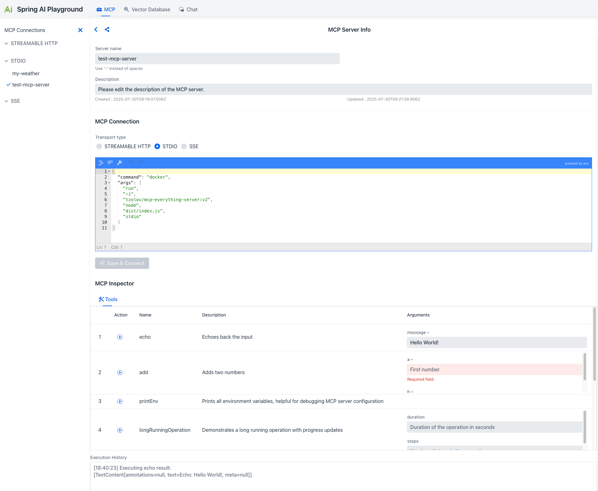

# Spring AI Playground

**Spring AI Playground is a self-hosted web UI platform for building low-code tools and dynamically exposing them via built-in MCP server for AI agents.**

Unlike most AI playgrounds that focus solely on prompt testing and chat visualization, it bridges the gap between **static AI conversations** and **real-world actions** by enabling you to create executable tools that AI agents can use.

It brings together **Large Language Models (LLMs)**, **Retrieval-Augmented Generation (RAG)**, and **low-code tool development** in a single environment. Tools created in the **Tool Studio** are dynamically evaluated and loaded at runtime, then automatically made available as **Model Context Protocol (MCP) tools**. This makes them instantly available to MCP-compatible clients without restarting or redeploying.

<p align="center">
  <b>Agentic Chat Demo</b><br/>
  Tool-enabled agentic AI built with Spring AI and MCP
</p>

<p align="center">
  <a href="https://youtu.be/FlzV7TN67f0">
    
  </a>
</p>

## Key Capabilities

### Tool Studio & Built-in MCP Server
Create AI tools using **JavaScript (ECMAScript 2023)** directly in the browser. Powered by **GraalVM Polyglot**, these tools run inside the JVM (Polyglot) with configurable security constraints and are immediately exposed via **built-in MCP Server**. Experience a no-restart, no-redeploy workflow: just write, test, and publish.

### MCP Server & Tool Inspection
Connect to external **MCP servers**, inspect available tools, and validate tool execution behavior. Test both your custom **Tool Studio tools** and third-party MCP services in a unified interface.

### Vector Database & RAG Pipeline
Upload documents, configure **chunking** and **embeddings**, and test retrieval pipelines. Evaluate prompt execution against selected RAG sources to validate **knowledge-grounded** responses.

### Agentic Chat & Agent Workflow
Interact with LLMs in a chat interface where models can reason, select tools, and execute actions. Combine **MCP tools** and **RAG-enhanced context** to validate end-to-end agent workflows.

## Why Spring AI Playground?

- **Dynamic MCP Hosting**: Build and expose tools in real-time with immediate MCP server exposure and no deployment overhead.
- **Unified Testing Hub**: Validate prompts, RAG pipelines, and agentic workflows in a single, cohesive environment.
- **Provider Agnostic**: Switch between Ollama, OpenAI, and other LLM providers (including OpenAI-compatible APIs) with ease.
- **Built for Modern AI**: Designed specifically for the Spring AI ecosystem, MCP protocol, and agent-oriented architectures.

## Project Scope & Positioning

Spring AI Playground is intentionally built as a **tool-first reference environment** for exploring, validating, and operationalizing Spring AI features in a reproducible way.
> **Note:** This project is intentionally opinionated and scope-limited in its early stages.
> It focuses on providing a stable, reproducible reference runtime for tool execution and MCP integration,
> rather than evolving into a feature-complete agent platform at this time.

**Current focus (what this project prioritizes):**
- Providing a UI-driven reference runtime that demonstrates how Spring AI features compose in practice.
- Testing and validating tool execution flows and RAG integration.
- Promoting validated tools to **standalone, deployment-ready MCP servers**
  that can be independently run and reused by multiple AI clients and agent runtimes.

**Important note:** While this Playground is not a full-fledged agent orchestration product today, it is explicitly designed as the **foundation** for building interoperable tool-first agents in the future. Validated tools and MCP-hosted runtimes created here are intended to be reusable by different AI systems and agent frameworks.

## Contributing & Scope

**Please read before opening issues or submitting contributions.**

### Current scope (what we accept):
- ✅ Bug reports and reproducible issues
- ✅ Documentation improvements and usage examples

### Out of scope (for now):
- ❌ Broad feature requests that expand the project's scope (we will not accept general feature requests at this stage)
- ❌ Experimental model integrations not officially supported by Spring AI
- ❌ High-level agent orchestration layers (Agent builders are a planned future layer built on top of validated tools)

### Reporting issues

Before opening an issue, please check:
- Use the Bug Report template for reproducible failures.
- For documentation fixes or improvements, please submit a documentation PR.
- General feature requests are out of scope at this stage — please read the Project Scope above.

We triage issues regularly; issues outside the scope may be closed with guidance on where to best contribute.

If you believe you have a contribution that fits the current scope, submit a PR or a targeted issue. For larger proposals, please open a short design note PR under `docs/design/` so it can be reviewed as a draft.

## Table of Contents

* [Spring AI Playground](#spring-ai-playground)
    * [Key Capabilities](#key-capabilities)
        * [Tool Studio & Built-in MCP Server](#tool-studio--built-in-mcp-server)
        * [MCP Server & Tool Inspection](#mcp-server--tool-inspection)
        * [Vector Database & RAG Pipeline](#vector-database--rag-pipeline)
        * [Agentic Chat & Agent Workflow](#agentic-chat--agent-workflow)
    * [Why Spring AI Playground?](#why-spring-ai-playground)
    * [Project Scope & Positioning](#project-scope--positioning)
    * [Contributing & Scope](#contributing--scope)
        * [Current scope (what we accept):](#current-scope-what-we-accept)
        * [Out of scope (for now):](#out-of-scope-for-now)
        * [Reporting issues](#reporting-issues)

* [Quick Start](#quick-start)
    * [Prerequisites](#prerequisites)
    * [Running the Application](#running-the-application)
        * [1. Running with Docker (Recommended)](#1-running-with-docker-recommended)
        * [2. Running Locally (From Source)](#2-running-locally-from-source)
    * [PWA Installation](#pwa-installation)
        * [Installing as PWA](#installing-as-pwa)

* [Auto-configuration](#auto-configuration)

* [AI Models](#ai-models)
    * [Support for Major AI Model Providers](#support-for-major-ai-model-providers)
    * [Selecting and Configuring Ollama Models](#selecting-and-configuring-ollama-models)
    * [Switching to OpenAI](#switching-to-openai)
    * [Switching to OpenAI-Compatible Servers](#switching-to-openai-compatible-servers)

* [Tool Studio](#tool-studio)
    * [Built-in MCP Server](#built-in-mcp-server)
        * [Security (Optional)](#security-optional)
    * [Connect to the Built-in MCP Server](#connect-to-the-built-in-mcp-server)
        * [Claude Code (CLI)](#claude-code-cli)
        * [Cursor (IDE)](#cursor-ide)
        * [Claude Desktop App](#claude-desktop-app)
    * [Dynamic Tool Exposure (Tool Studio ↔ MCP Server)](#dynamic-tool-exposure-tool-studio--mcp-server)
    * [JavaScript Runtime](#javascript-runtime)
    * [Key Features](#key-features)
    * [Low-code Tool Development Workflow](#low-code-tool-development-workflow)
    * [Pre-built Example Tools](#pre-built-example-tools)
    * [Using Tools in Agentic Chat](#using-tools-in-agentic-chat)

* [MCP Server](#mcp-server)
    * [Key Features](#key-features-1)
    * [Getting Started with MCP](#getting-started-with-mcp)

* [Vector Database](#vector-database)
    * [Support for Major Vector Database Providers](#support-for-major-vector-database-providers)
    * [Key Features](#key-features-2)

* [Agentic Chat](#agentic-chat)
    * [Key Features](#key-features-3)
    * [Two Integrated Paradigms](#two-integrated-paradigms)
        * [1. RAG: Knowledge via Chain Workflow](#1-rag-knowledge-via-chain-workflow)
        * [2. MCP: Actions via Agentic Reasoning](#2-mcp-actions-via-agentic-reasoning)
    * [Workflow Integration](#workflow-integration)
    * [⚠️ Requirements for Agentic Reasoning (Ollama)](#-requirements-for-agentic-reasoning-ollama)
    * [Agentic Chat Architecture Overview](#agentic-chat-architecture-overview)

* [Upcoming Features](#upcoming-features)
    * [Advanced Agentic Tooling (Capability Factory)](#advanced-agentic-tooling-capability-factory)
    * [Infrastructure & Enterprise Features](#infrastructure--enterprise-features)
  
## Quick Start
### Prerequisites
To fully experience the "Local First" capabilities of Spring AI Playground, the following are required:

- **Ollama:**
    - Download and install [Ollama](https://ollama.com/) on your machine.
    - Run `ollama serve` or ensure the Ollama app is running.
    - *This ensures fast, private, and GPU-accelerated local inference.*
- **Docker:** [Docker](https://www.docker.com/) installed and running.
- **(Optional) Java 21+ & Git:** Only required if you plan to build from source.

### Running the Application

#### 1. Running with Docker (Recommended)
This is the standard way to run the application. It runs the Playground in a container while connecting to your high-performance local Ollama instance.

1. **Run Container**:
   ```bash
   docker run -d -p 8282:8282 --name spring-ai-playground \
   -e SPRING_AI_OLLAMA_BASE_URL=http://host.docker.internal:11434 \
   -v spring-ai-playground:/home \
   --restart unless-stopped \
   ghcr.io/spring-ai-community/spring-ai-playground:latest
   ```
> ***Notes:***
>- Data Persistence: Application data is stored in the spring-ai-playground Docker volume, ensuring data persists even if the container is removed.
>- Ollama Connection: The environment variable SPRING_AI_OLLAMA_BASE_URL is set to http://host.docker.internal:11434. Adjust the URL if Ollama runs on a different host or port.
>- Automatic Restart: The --restart unless-stopped option ensures the container restarts automatically unless manually stopped with docker stop.
> - ***For Linux Users:*** The `host.docker.internal` DNS name may not be available on all Linux distributions. If you encounter connection issues, you may need to use `--network="host"` in your `docker run` command or replace `host.docker.internal` with your host machine's IP address on the Docker bridge network (e.g., `172.17.0.1`).

> ⚠️ **MCP STDIO Transport Limitation**  
> While Docker is recommended for most scenarios, it is not suitable for testing MCP STDIO transport. MCP STDIO transport requires direct process-to-process communication, which containerized environments cannot provide reliably.
>
> If you plan to test the MCP STDIO transport, please use the [Running Locally (From Source)]
> (#2-running-locally-from-source) 
> instead.

#### 2. Running Locally (From Source)
Use this method for development or if you need to use **MCP STDIO** transport features.

1. **Clone the Repository**:
   ```bash
   git clone https://github.com/spring-ai-community/spring-ai-playground.git
   cd spring-ai-playground
   ```

2. **Build and Run**:
   ```bash
   ./mvnw clean install -Pproduction -DskipTests=true
   ./mvnw spring-boot:run
   ```

3. **Access the Application**:
   Open `http://localhost:8282` in your browser.

### PWA Installation

> **Note**: Complete either the Docker or Local installation steps above before proceeding with PWA installation.

**Spring AI Playground** comes with Progressive Web App (PWA) capabilities, allowing you to install it as a standalone application on your device for a native app-like experience.

#### Installing as PWA

1. Open the application in your web browser at `http://localhost:8282`
2. Install using one of the following methods:
    - Browser PWA Install Popup: Most modern browsers will automatically show a PWA installation popup or prompt in the address bar
    - Install PWA Button: Look for the "Install PWA" button on the application's home page and click it
3. Follow the installation wizard to complete the setup and add the app to your device

## Auto-configuration

Spring AI Playground uses Ollama by default for local LLM and embedding models. No API keys are 
required, which makes it easy to get started.

## AI Models
To enable Ollama, ensure it is installed and running on your system. Refer to the [Spring AI Ollama Chat Prerequisites](https://docs.spring.io/spring-ai/reference/api/chat/ollama-chat.html#_prerequisites) for setup details.

### Support for Major AI Model Providers
Spring AI Playground supports major AI model providers through Spring AI integrations, including Anthropic, OpenAI, Microsoft, Amazon, Google, and Ollama. For more details on the available implementations, visit the [Spring AI Chat Models Reference Documentation](https://docs.spring.io/spring-ai/reference/api/chatmodel.html#_available_implementations).

### Selecting and Configuring Ollama Models
When running Spring AI Playground with the **`ollama`** profile, you can configure the default chat and embedding models, as well as the list of available models in the playground UI, by updating your configuration file (`application.yaml`).
> **Notes:**
>- `pull-model-strategy: when_missing` ensures that the configured models are automatically pulled from Ollama if they are not already available locally.
>- `playground.chat.models` controls which models appear in the model selection dropdown in the web UI.
>- Changing the `chat.options.model` or `embedding.options.model` here updates the defaults used by the application.

> **Pre‑pull Recommended Ollama Models** to avoid delays when first using a model, pre-pull it with Ollama before starting Spring AI Playground.

### Switching to OpenAI

Switching to **OpenAI** is a primary example of how you can use a different AI model with Spring AI Playground. To explore other models supported by Spring AI, learn more in the [Spring AI Documentation](https://spring.io/projects/spring-ai).

By default, Spring AI Playground uses Ollama as the primary AI model provider. To switch to OpenAI at runtime (without modifying files like `pom.xml` or `application.yaml`), activate the `openai` profile and provide the API key via environment variables.

To switch to OpenAI, follow these steps:

- **Activate the OpenAI Profile at Runtime**:
    - Specify `--spring.profiles.active=openai` when running the application. This overrides the default Ollama profile.

- **Provide OpenAI API Key via Environment Variable**:
    - The default `application.yaml` uses `${OPENAI_API_KEY}` as a placeholder for the API key.
    - Set the environment variable before running:
      - Unix/Mac:
      ```bash
      export OPENAI_API_KEY=your-openai-api-key
      ```  
      - Windows:
      ```bash
      set OPENAI_API_KEY=your-openai-api-key
      ```
    - Alternatively, pass it directly in the run command (overrides env var if set).

- **Run the Application with OpenAI Settings**:
    - For Docker run (combine profile and API key):
      ```bash
      docker run -d -p 8282:8282 --name spring-ai-playground \
      -e SPRING_PROFILES_ACTIVE=openai \
      -e OPENAI_API_KEY=your-openai-api-key \
      -v spring-ai-playground:/home \
      --restart unless-stopped \
      ghcr.io/spring-ai-community/spring-ai-playground:latest
        ``` 
    - For local run (using Maven, combine profile and API key):
      ```bash
      ./mvnw spring-boot:run --spring.profiles.active=openai --spring.ai.openai.api-key=your-openai-api-key
      ```
### Switching to OpenAI-Compatible Servers

You can connect Spring AI to OpenAI-compatible servers such as `llama.cpp`, `TabbyAPI`, `LM Studio`, `vLLM`, `Ollama`, or others that expose OpenAI-compatible endpoints (e.g., `/v1/chat/completions`) by configuring the following properties in `application.yml` or via environment variables/run arguments. This leverages Spring AI's OpenAI Chat Client, which supports seamless integration with these servers.

```yaml
# Quick Start Example - Ollama as OpenAI-compatible server
spring:
  ai:
    openai:
      api-key: "not-used"  # No auth required for local Ollama
      base-url: "http://localhost:11434/v1"
      chat:
        options:
          model: "llama3.2"

# For more examples (llama.cpp, TabbyAPI, LM Studio, vLLM),
# see the detailed configuration section below.
```

**Configuration Details:**
- `api-key`: Required by Spring AI for all requests. Use a real key if server authentication is enabled (e.g., TabbyAPI). For unauthenticated servers (e.g., local llama.cpp, Ollama), a placeholder like "not-used" works. Supports environment variables for security (e.g., `${OPENAI_API_KEY}` or set via `export OPENAI_API_KEY=your-key`).
- `base-url`: Points to the server's root endpoint. Include /v1 if your server requires it (e.g., Ollama often uses http://localhost:11434/v1). Spring AI appends paths like /chat/completions automatically. Test with `curl <base-url>/v1/models` to verify.
- `model`: Must exactly match the model name registered on the server (e.g., "meta-llama/Llama-3-8B-Instruct" for vLLM). Use the server's /models endpoint to list available models.
- `completions-path`: Override only if the server deviates from the OpenAI standard (default: "/v1/chat/completions"). Most compatible servers adhere to this.
- `extra-body`: Key for passing non-standard parameters (e.g., sampling controls like `top_k`, `repetition_penalty`, `num_predict`). Ignored by official OpenAI but essential for servers like vLLM or Ollama.
- `http-headers`: Optional for custom authentication headers (e.g., overriding API key with Bearer token).
- Streaming Support: Automatically enabled if the server supports Server-Sent Events (SSE). Use `StreamingChatModel` in code for flux responses. Most compatible servers (e.g., llama.cpp, Ollama) support this.
- Other Options: For max tokens, use `maxTokens` (non-reasoning models) or `maxCompletionTokens` (reasoning models like o1 or deepseek-reasoner); avoid setting both.

**Server-Specific Examples:**

**llama.cpp server:**
```yaml
spring:
  ai:
    openai:
      api-key: "not-used"  # No auth typically required
      base-url: "http://localhost:8080/v1"  # Include /v1 if server exposes it
      chat:
        options:
          model: "your-model-name"  # e.g., llama3
          extra-body:  # Optional server-specific params
            top_k: 40
            repetition_penalty: 1.1
```

**TabbyAPI:**
```yaml
spring:
  ai:
    openai:
      api-key: "your-tabby-key"  # Use real key if auth enabled in TabbyAPI
      base-url: "http://localhost:5000/v1"  # Adjust port/path as per setup
      chat:
        options:
          model: "your-exllama-model"  # e.g., mistral
          extra-body:  # Tabby-specific if needed
            top_p: 0.95
```

**LM Studio:**
```yaml
spring:
  ai:
    openai:
      api-key: "not-used"  # Typically no auth
      base-url: "http://localhost:1234/v1"  # Default LM Studio port with /v1
      chat:
        options:
          model: "your-loaded-model"  # e.g., phi3
          extra-body:  # Optional
            num_predict: 100
```

**Ollama (Additional Example):**
```yaml
spring:
  ai:
    openai:
      api-key: "not-used"  # Optional; Ollama often doesn't require
      base-url: "http://localhost:11434/v1"  # Standard Ollama endpoint
      chat:
        options:
          model: "llama3.2"  # Match Ollama model name
          extra-body:
            num_predict: 200
            top_k: 40
```

**vLLM (Additional Example):**
```yaml
spring:
  ai:
    openai:
      api-key: "not-used"
      base-url: "http://localhost:8000/v1"  # vLLM default
      chat:
        options:
          model: "meta-llama/Llama-3-8B-Instruct"
          extra-body:
            top_p: 0.95
            repetition_penalty: 1.1
```

> **Note**:
> Ensure your server fully adheres to OpenAI’s API specification for best compatibility, including support for `/v1/chat/completions` and proper model listing at `/v1/models`. Verify server capabilities with tools like curl (e.g., `curl http://localhost:8080/v1/models`). Streaming works if the server supports SSE. For production, use environment variables for secrets. Refer to [Spring AI OpenAI Chat Documentation](https://docs.spring.io/spring-ai/reference/api/chat/openai-chat.html) for full details on advanced options like `stream-usage` or reasoning model support. Test connectivity before integrating.

## Tool Studio


Spring AI Playground's **Tool Studio** is a low-code tool development interface where you can create, test, and publish AI-callable tools using JavaScript.
Tools created in Tool Studio are dynamically evaluated at runtime and automatically exposed as MCP (Model Context Protocol) tools via the built-in MCP server—no restart or redeploy required.

### Built-in MCP Server

Spring AI Playground runs a **built-in MCP server** automatically on startup.

- **Endpoint**: `http://localhost:8282/mcp`
- **Type**: Streamable HTTP
- **Default server**: `spring-ai-playground-tool-mcp`

> Note: Since the Playground itself acts as an MCP host, external MCP-compatible clients can connect directly to this endpoint and consume your tools.

#### Security (Optional)

The built-in server leverages Spring AI's native MCP security infrastructure, which integrates directly with Spring Security.

By default, authentication is disabled to simplify local development. To enable production-grade security (e.g., OAuth2 or API Key), you can apply Spring AI’s official security configurations without changing the core tool logic.

See the Spring AI documentation for details:
[Spring AI MCP Security Documentation](https://docs.spring.io/spring-ai/reference/api/mcp/mcp-security.html)

### Connect to the Built-in MCP Server

Once the Playground application is running, the built-in MCP server is available at `http://localhost:8282/mcp`. You can connect various MCP-compatible clients to this endpoint for tool consumption.

#### Claude Code (CLI)
Claude Code supports Streamable HTTP transport in recent versions.

Run the following command in your terminal to add the server:

```bash
claude mcp add spring-ai-playground http://localhost:8282/mcp
```

Once added, restart Claude Code if necessary. The tools from Tool Studio will be available for use.

#### Cursor (IDE)
Cursor supports connecting to MCP servers via Streamable HTTP/SSE.

Follow these steps to connect:
1. Open Cursor Settings (Ctrl + , or Cmd +).
2. Navigate to **Features > MCP**.
3. Click the **+ Add New MCP Server** button.
4. Fill in the details:
    - **Name**: Spring AI Playground
    - **Type**: Streamable HTTP
    - **URL**: `http://localhost:8282/mcp`
5. Click **Add**.

After connecting, the tools will appear in Cursor's Composer, Chat, or other AI features. If you encounter connection issues, ensure your Cursor version is up-to-date.

#### Claude Desktop App

**Prerequisites:** Native remote connections through the UI typically require a Pro, Max, Team, or Enterprise plan.

**Method 1: Using Settings UI (Pro+ Plans Only)**

1. Open Claude Desktop
2. Navigate to **Settings → Connectors**
3. Click **Add custom connector**
4. Enter:
    - **Name**: Spring AI Playground
    - **URL**: `http://localhost:8282/mcp`
5. Save and restart Claude Desktop

**Method 2: Using Proxy for All Plans (Recommended for Free Users)**

If you are on a Free plan or encounter connection issues with Method 1, use the `mcp-remote` proxy. This wraps the Streamable HTTP connection into a local process, ensuring compatibility across all plans.

1. Open your Claude Desktop config file:
    - macOS: `~/Library/Application Support/Claude/claude_desktop_config.json`
    - Windows: `%APPDATA%\Claude\claude_desktop_config.json`

2. Add the following configuration:

```json
{
  "mcpServers": {
    "spring-ai-playground": {
      "command": "npx",
      "args": ["-y", "mcp-remote", "http://localhost:8282/mcp"]
    }
  }
}
```

3. Restart Claude Desktop

After connecting, tools published from the Tool Studio will appear automatically as available MCP tools in Claude.

### Dynamic Tool Exposure (Tool Studio ↔ MCP Server)

Tool Studio is tightly integrated with the built-in MCP server.

- When you create or update a tool in Tool Studio, it is **dynamically discovered and exposed**
  by the default MCP server (`spring-ai-playground-tool-mcp`) at runtime.
- Exposed tools appear under the **MCP Server** menu, where you can inspect schemas and validate execution behavior using the Tool Inspector.
- This enables a **no-restart, no-redeploy workflow**: write → test → make available immediately.

### JavaScript Runtime

Tool actions are implemented in **JavaScript (ECMAScript 2023)** executed *inside the JVM* (GraalVM Polyglot runtime).

- **Runtime**: JavaScript (ECMAScript 2023) inside the JVM (polyglot).
- **Java interop**: Controlled via whitelist and configuration.
- **Sandboxing**: Unsafe operations (file I/O, native access, etc.) are restricted by design; tool code should be kept minimal and deterministic.

> **Security Note**: Host access is strictly controlled to ensure safe execution. By default, all broad access is disabled, and only explicitly allowed Java classes and capabilities are exposed. Configuration is done via `application.yml`:
>
> ```yaml
> js-sandbox:
>   allow-network-io: true      # Allows network access (required for API calls in tools)
>   allow-file-io: false        # Blocks file system access for enhanced security
>   allow-native-access: false  # Disables native code access
>   allow-create-thread: false  # Prevents thread creation
>   max-statements: 500000      # Prevents infinite loops and DoS attacks
>   allow-classes:              # Whitelist-based class access
>     # Completely safe core packages — strongly recommended to allow entirely
>     - java.lang.*             # String, StringBuilder, System.getProperty, etc. (basic utilities)
>     - java.math.*             # BigDecimal, BigInteger, etc. (mathematical calculations)
>     - java.time.*             # Instant, Duration, ZonedDateTime, etc. (date/time handling)
>     - java.util.*             # List, Map, Set, UUID, Base64, Collections, etc. (collections and utilities)
>     - java.text.*             # DateFormat, NumberFormat, etc. (formatting utilities)
> 
>     # Networking — core functionality of Tool Studio
>     - java.net.*              # URL, HttpURLConnection, URI, URLEncoder, etc.
> 
>     # I/O streams — used for handling network responses (safe because allow-file-io: false blocks file access)
>     - java.io.*
> 
>     # Modern HTTP client
>     - java.net.http.HttpClient
>     - java.net.http.HttpRequest
>     - java.net.http.HttpResponse
>     - java.net.http.HttpHeaders
> 
>     # HTML parsing library — currently used in examples
>     - org.jsoup.*
> ```
>
> This configuration balances functionality (e.g., network calls required for tools) with security. For stricter environments, you may consider enabling GraalVM's `SandboxPolicy.CONSTRAINED` directly in code for additional automatic restrictions. See the [GraalVM Security Guide](https://www.graalvm.org/latest/security-guide/sandboxing/) for advanced options.

### Key Features

- 
  **Tool MCP Server Setting (Expose tools via MCP)**:
    - **Enable Auto-Add Tools**: Toggle whether tools created/updated in Tool Studio are automatically exposed via the built-in MCP server.
    - **Registered Tools**: Choose which tools from the Tool List are currently exposed; the exposed set is updated 
      automatically as you change the selection.
    - Recommended usage: keep many tools in your workspace, but expose only a controlled subset to MCP clients.

- 
  **View Tool Specification (JSON)**:
    - Display the current tool specification in JSON format (metadata + parameter schema).
    - Useful for validating what will be published/consumed and for debugging schema/argument mismatches.

- 
  **Copy to New Tool (Template workflow)**:
    - Create a new tool by cloning the current tool definition and implementation.
    - Recommended workflow: duplicate built-in example tools and adapt them, instead of starting from a blank tool.

- **Tool list & selection**:
    - Browse existing tools and load them into the editor for editing/testing.
    - Built-in tools can serve as references (e.g., `sendSlackMessage`, `openaiResponseGenerator`, `googlePseSearch`, `getWeather`, `buildGoogleCalendarCreateLink`, `getCurrentTime`, `extractPageContent`).

- **Tool metadata**:
    - Edit **Tool Name** and **Tool Description** to define a stable tool-call identifier and an agent-friendly explanation.
    - Naming guidance:
        - Prefer verbs (`sendSlackMessage`, `extractPageContent`).
        - Keep names stable once referenced by agents/workflows.

- **Structured parameters**:
    - Define the tool’s input schema (what the LLM will pass at call time):
        - Required flag
        - Name / Type (e.g., `STRING`) / Description
        - Test value for quick iteration
    - Use multiple parameters for more deterministic tool calls (avoid “one big prompt string” when possible).

- **Static variables**:
    - Define key/value variables that are injected into the action context.
    - Support environment indirection (e.g., `${ENV_VAR}`) to avoid hardcoding secrets.
    - Typical usage: API keys, base URLs, workspace IDs, model/provider toggles.

- **JavaScript action development (ECMAScript 2023 inside the JVM)**:
    - Implement tool logic in JavaScript executed inside the JVM (polyglot runtime).
    - Return a JSON-serializable object; this becomes the tool output consumed by agents.
    - Keep actions small and deterministic; use explicit error handling and structured outputs.

- **Integrated testing & debugging**:
    - Execute instantly with **Test Run** (using the parameter test values).
    - Inspect status/timing/result in the **Debug Console**.
    - Publish changes with **Test & Update Tool** so the tool definition is updated and MCP exposure settings can apply immediately.

### Low-code Tool Development Workflow

1. **Open Tool Studio**
    - Navigate to `Tool Studio` in the top menu.

2. **Define tool**
    - **Tool Name**: Use letters/numbers/underscore; must start with a letter.
    - **Tool Description**: Describe the intent clearly for agent/tool selection.
    - **Add parameters**
      - Add one or more parameters with name/type/description.
      - Mark required inputs and set **Test Value** for fast iteration.
    - **Add static variables (optional)**
      - Provide configuration values (e.g., API tokens).
      - Prefer environment indirection (e.g., `${ENV_VAR}`) for secrets.
    - **Write action code (JavaScript)**
      - Implement the tool logic in the JS editor.
      - Return a JSON-serializable object as the tool output.
    - **Test**
      - Click **Test Run** and debugging:
          - Console Log : using `console.log()`
          - Status: Success/Failure
          - Elapsed time
          - Result payload
3. **Publish (dynamic registration)**
   - Click **Test & Update Tool** to save.
   - The tool becomes immediately available on `spring-ai-playground-tool-mcp` without restart.

### Pre-built Example Tools

Tool Studio includes pre-built tools you can use as reference implementations (and as templates via the copy-to-new-tool workflow).

> Note: Some examples require environment variables (or static variables mapped to env values) before they can run successfully.

- `googlePseSearch` - Search the web using Google Programmable Search Engine (PSE).
    - Requires: `${GOOGLE_API_KEY}`, `${PSE_ID}`
- `extractPageContent` - Extracts and cleans the main textual content from a given web page URL by removing ads, navigation, scripts, and other unnecessary elements.
- `buildGoogleCalendarCreateLink` - Builds a Google Calendar "Add Event" URL with prefilled fields. The tool only 
  generates a URL; the user must open it and click "Save" in Google Calendar.
- `sendSlackMessage` - Send messages to Slack channels using an Incoming Webhook URL.
    - Requires: `${SLACK_WEBHOOK_URL}`
- `openaiResponseGenerator` - Generate AI responses via OpenAI API.
    - Requires: `${OPENAI_API_KEY}`
- `getWeather` - Get the current weather for a given location by calling wttr.in JSON API and return a compact JSON summary (temperature °C, humidity, wind speed, wind direction).
- `getCurrentTime` - Returns the current time in ISO 8601 format.

### Using Tools in Agentic Chat

Tool Studio tools can be used in **Agentic Chat** through MCP integration.

- In the Chat menu, select the MCP server `spring-ai-playground-tool-mcp` (available by default).
- With tool-capable models (e.g., Ollama models such as `qwen3`, `gpt-oss`, or other configured providers), the model 
  can call your tools during agentic workflows.

## MCP Server



Spring AI Playground now includes a comprehensive **MCP Server** that provides a visual interface for managing connections to external tools through AI models. This feature leverages Spring AI's Model Context Protocol implementation to offer client-side capabilities.

### Key Features

- **Connection Management**: Configure and manage MCP connections with multiple transport types including STREAMABLE HTTP, STDIO, and legacy HTTP+SSE transports.
- **Server Configuration**: Configure connections to MCP servers with customizable names, descriptions, and connection parameters.
- **MCP Inspector**: Explore available tools and their capabilities with detailed information including:
    - Tool names and descriptions
    - Required arguments and parameters
    - Action definitions and specifications
- **Interactive Tool Testing**: Execute MCP tools directly from the playground with real-time results and execution history.

> **Note**: **STREAMABLE HTTP** officially introduced in the MCP v2025‑03‑26 specification (March 26, 2025) — is a single-endpoint HTTP transport that replaces the former HTTP+SSE setup. Clients send JSON‑RPC via POST to /mcp, while responses may optionally use an SSE-style stream, with session‑ID tracking and resumable connections.

### Getting Started with MCP

1. **Configure MCP Server Connection**:
    - Access the MCP Playground from the main interface
    - Set up your MCP server connection with the appropriate transport type and connection details

2. **Explore Available Tools**:
    - Use the MCP Inspector to browse available tools and their specifications
    - Review tool descriptions, required arguments, and expected parameters
    - Understand the capabilities of your MCP server connection setup

3. **Test Tool Execution**:
    - Select tools from the inspector and execute them with appropriate arguments
    - Monitor execution results and review the execution history
    - Debug and refine your MCP integration based on real-time feedback

This MCP Playground provides developers with a powerful visual tool for prototyping, testing, and debugging Model Context Protocol integrations, making it easier to build sophisticated AI applications with contextual awareness.

## Vector Database


**Spring AI Playground** offers a comprehensive vector database playground with advanced retrieval capabilities powered by Spring AI's VectorStore API integration.

- **Multi-Provider Testing**: Switch between vector database providers without code changes
- **Syntax Standardization**: Query different databases using Spring AI's unified interface

### Support for Major Vector Database Providers
[Vector Database providers](https://docs.spring.io/spring-ai/reference/api/vectordbs.html#_vectorstore_implementations) including Apache Cassandra, Azure Cosmos DB, Azure Vector Search, Chroma, Elasticsearch, GemFire, MariaDB, Milvus, MongoDB Atlas, Neo4j, OpenSearch, Oracle, PostgreSQL/PGVector, Pinecone, Qdrant, Redis, SAP Hana, Typesense and Weaviate.

### Key Features

- **Custom Chunk Input**: Directly input and chunk custom text for embedding, allowing detailed RAG pipeline testing.
- **Document Uploads**: Upload files such as **PDFs, Word documents, and PowerPoint presentations**, and benefit from an end-to-end process of **text extraction → chunking → embedding**.
- **Search and Scoring**: Perform vector similarity searches and visualize results with **similarity scores (0-1)** for easy evaluation.
- **Spring AI Filter Expressions**: Utilize metadata-based filtering (e.g., `author == 'John' && year >= 2023`) to narrow search scopes and refine query results.

These features, combined with Spring AI's flexibility, provide a comprehensive playground for vector database testing and advanced integration into your applications.

## Agentic Chat

**Agentic Chat** is an interactive environment for running **Spring AI Agentic Systems**. It provides a unified interface for executing **chain-based RAG workflows** and **tool-enabled agents** via MCP with advanced reasoning. It enables you to test and validate AI agents in a low-code environment by combining RAG from your indexed documents and dynamic tool execution via the MCP. This unified interface lets you:

- **Run RAG Workflows**: Ground AI responses in your own documents using chain-based retrieval
- **Execute Tool-Enabled Agents**: Use MCP-connected tools with LLM reasoning for multi-step problem solving
- **Test Agentic Strategies**: Validate complete agent behaviors by selecting documents and tools in a single chat session

### Key Features

- **Document Selection**: Choose from indexed documents to enable RAG and ground responses in your knowledge base
- **Tool Selection**: Select MCP connections to enable tool-enabled agents with autonomous reasoning
- **Real-time Feedback**: View retrieved documents, executed tools, and reasoning chains in conversation responses
- **Combined Workflows**: Run both RAG and tool-enabled agents simultaneously for comprehensive AI interactions
- **Model Support**: Use any LLM provider; tool-enabled agents require models with function calling and reasoning capabilities

### Two Integrated Paradigms

This integration brings the power of [Building Effective Agents](https://docs.spring.io/spring-ai/reference/api/effective-agents.html) into a single, intuitive interface for rapid prototyping and optimization.
Agentic Chat operates by combining two distinct patterns:

#### 1. RAG: Knowledge via Chain Workflow
This follows a deterministic **Chain Workflow**. When you select documents, the system follows a fixed sequence:
* **Retrieval**: It searches your Vector Database for relevant information.
* **Augmentation**: It injects that information as context into the prompt.
* **Generation**: The LLM answers based on the provided facts.

> **Setup**: Upload and manage your documents in the **Vector Database** before selecting them in the Agentic Chat sidebar.

#### 2. MCP: Actions via Agentic Reasoning
This follows a dynamic **Agentic Workflow**. When MCP connections are enabled, the LLM acts as an autonomous agent:
* **Reasoning**: The model analyzes your request and decides which tools are necessary.
* **Action**: It calls tools (via MCP) to fetch real-time data or perform external actions.
* **Observation**: It evaluates the tool output and decides if further actions or a final response are needed.


### Workflow Integration

1.  **Configure Capabilities**:
    * Set up your knowledge base in **Vector Database**.
    * Configure your external tools in **MCP Server**.
    * Develop your own tools in **Tool Studio**.
2.  **Compose Your Agent**:
    * In the **Agentic Chat** page, select the specific **Documents** (Knowledge) and **MCP Connections** (Tools) you want to enable.
3.  **Execute & Observe**:
    * Send a message. The LLM will use the RAG chain for context and reasoning-based MCP tool calls to fulfill the request.

### ⚠️ Requirements for Agentic Reasoning (Ollama)

To fully utilize the **Agentic** capabilities (especially MCP tool usage), the underlying model must be specifically trained for **Reasoning** and **Function Calling**.

* **Tool-Enabled Models**: Ensure you are using a model from [Ollama's Tool Category](https://ollama.com/search?c=tools).
* **Reasoning-Enabled Models**: Ensure you are using a model from [Ollama's Thinking Category](https://ollama.com/search?c=thinking).
* **Reasoning Power**: Models like **Qwen 3** and **GPT-OSS** are recommended for their ability to handle the complex logic required for tool orchestration.
* **Verification**: Always test your tool configurations in the **MCP Inspector** before running them in the Agentic Chat.

### Agentic Chat Architecture Overview


This Chat experience facilitates exploration of Spring AI's workflow and agentic paradigms, empowering developers to build AI systems that combine chain-based RAG workflows with agentic, tool-augmented reasoning, following Spring AI’s Agentic Systems architecture with tool-augmented reasoning (via agents) for robust, context-aware prototypes.

| Component           | Type                 | Description                                                                                                 | Configuration Location                   | Key Benefits                                                                                           | Model Requirements                                                |
|---------------------| -------------------- | ----------------------------------------------------------------------------------------------------------- |------------------------------------------| ------------------------------------------------------------------------------------------------------ | ----------------------------------------------------------------- |
| **LLM**             | Core Model           | Executes chain-based workflows and performs agentic reasoning for tool usage within a unified chat runtime. | Agentic Chat                             | Central reasoning and response generation; supports both deterministic workflows and agentic patterns. | Chat models; tool-aware and reasoning-capable models recommended. |
| **Retrieval (RAG)** | Chain Workflow       | Deterministic retrieval and prompt augmentation using vector search over selected documents.                | Vector Database                          | Predictable, controllable knowledge grounding; tunable retrieval parameters (Top-K, thresholds).       | Standard chat + embedding models.                                 |
| **Tools (MCP)**     | Agentic Execution    | Dynamic tool selection and invocation via MCP, driven by LLM reasoning and tool schemas.                    | Tool Studio, MCP Playground              | Enables external actions, multi-step reasoning, and adaptive behavior.                                 | Tool-enabled models with function calling and reasoning support.  |
| **Memory**          | Shared Agentic State | Sliding window conversation memory shared across workflows and agents via ChatMemoryAdvisor.                | Spring AI Framework (InMemoryChatMemory) | Coherent multi-turn dialogue with a sliding window (Max: 10); improves coherence, planning, and tool usage quality.     | Models benefit from longer context and structured reasoning.      |

By leveraging these elements, the Agent Chat menu goes beyond basic Q&A, enabling the creation of 
effective, modular AI applications that incorporate both workflow predictability and agentic autonomy.

## Upcoming Features

Here are some features we are planning to develop for future releases of Spring AI Playground:

### Advanced Agentic Tooling (Capability Factory)

Planned features to abstract reusable agentic configurations into **first-class built-in tools**:

* **MCP Tool Composer**: Ability to group multiple tools from different MCP servers into a single, unified tool.
* **RAG Tool Generator**: Automatically turn a specific Vector Database query configuration (including similarity thresholds and Top-K) into a reusable RAG tool.
* **Agent-as-a-Tool**: Package an entire Agentic Chat configuration—including specific LLM settings, document selections, and MCP toolsets—into a standalone "Agent Tool" that can be called by other agents.

### Infrastructure & Enterprise Features
- **Observability**: Tracking and monitoring for AI performance, usage, and errors
- **Authentication**: Login and security features for access control
- **Multimodal Support**: Embedding, image, audio, and moderation models from Spring AI

These features will help make Spring AI Playground even better for testing and building AI projects.
